<p align="center">
  
</p>

# 🛡️ Slop Security Specification

> **One line to secure, zero lines to worry.**

[](https://owasp.org/www-project-top-ten/)
[]()
[]()

---

## 📖 Table of Contents

1. [The Slop Philosophy](#-the-slop-philosophy)
2. [AI-First Design](#-ai-first-design)
3. [OWASP Core Integration](#-owasp-core-integration)
4. [The Universal Engine](#-the-universal-engine)
5. [The Slop Manifest (slop.json)](#-the-slop-manifest-slopjson)
6. [Language SDK Blueprints](#-language-sdk-blueprints)
7. [The "Vibe-Check" CLI](#-the-vibe-check-cli)
8. [System Instructions Snippet](#-system-instructions-snippet)
9. [Architecture Diagrams](#-architecture-diagrams)
10. [Contributing](#-contributing)

---

## 🧘 The Slop Philosophy

### Zero-Cognitive-Load Principle

Vibecoders move fast. They build apps at lightning speed, shipping MVPs before coffee gets cold. Security? That's someone else's problem... until it isn't.

**Slop Security** is built on one core belief:

> *Security shouldn't require a PhD. It should require one line of code.*

#### The Three Pillars of Slop

```
┌─────────────────────────────────────────────────────────────────┐
│                    THE SLOP TRINITY                             │
├─────────────────────────────────────────────────────────────────┤
│                                                                 │
│   🧠 ZERO COGNITIVE LOAD     →  No config, no documentation,   │
│                                  no decisions required          │
│                                                                 │
│   ⚡ INSTANT INTEGRATION     →  One import, one function call, │
│                                  infinite protection            │
│                                                                 │
│   🤖 AI-NATIVE DESIGN        →  Built FOR AI-generated code,   │
│                                  BY AI-aware developers         │
│                                                                 │
└─────────────────────────────────────────────────────────────────┘
```

#### What is "Slop"?

**Slop** (noun): Code generated by AI that works but wasn't written with security in mind. It's the Rails scaffold that ships to production. It's the ChatGPT snippet pasted without review. It's beautiful, functional chaos.

**Slop Security** doesn't judge your slop. It **protects** it.

---

## 🤖 AI-First Design

Slop Security is optimized for LLM integration from the ground up. This means:

### 1. Predictable API Surface

Every SDK follows the exact same pattern:

```javascript
// Same pattern across ALL languages
slop.secure(yourApp)     // Wrap your app
slop.sandbox(yourCode)   // Sandbox untrusted code
slop.check(yourInput)    // Validate any input
```

### 2. LLM-Parseable Configuration

The `slop.json` schema is designed to be:
- **Deterministic** – Same input always produces same output
- **Self-documenting** – Every field has inline descriptions
- **AI-editable** – LLMs can modify settings with confidence

### 3. Inline Documentation for Context Windows

All functions include JSDoc/docstrings optimized for AI context:

```javascript
/**
 * @slop Automatically applies OWASP A03 (Injection) protection
 * @param {string} query - Raw SQL query (will be parameterized)
 * @param {Object} params - Query parameters (auto-escaped)
 * @returns {Promise<Result>} Safe query result
 * @ai-hint Always use this instead of raw query execution
 */
slop.query(query, params)
```

### 4. AI Integration Hooks

```javascript
// For AI agents that generate code at runtime
slop.onCodeGeneration((code) => {
  return slop.sandbox(code, { 
    timeout: 5000,
    permissions: ['network', 'filesystem:read']
  })
})
```

---

## 🔐 OWASP Core Integration

Slop Security provides **automatic, default-on protection** against the OWASP Top 10. No configuration required.

### OWASP Top 10 → Slop Protection Matrix

| OWASP ID | Vulnerability | Slop Protection | Auto-Enabled |
|----------|---------------|-----------------|--------------|
| **A01:2021** | Broken Access Control | `AccessGuard` middleware | ✅ |
| **A02:2021** | Cryptographic Failures | `CryptoShield` wrapper | ✅ |
| **A03:2021** | Injection | `QuerySanitizer` engine | ✅ |
| **A04:2021** | Insecure Design | `DesignValidator` linter | ✅ |
| **A05:2021** | Security Misconfiguration | `ConfigHardener` defaults | ✅ |
| **A06:2021** | Vulnerable Components | `DependencyScanner` | ✅ |
| **A07:2021** | Auth Failures | `AuthGuard` middleware | ✅ |
| **A08:2021** | Software/Data Integrity | `IntegrityChecker` | ✅ |
| **A09:2021** | Logging Failures | `SecureLogger` | ✅ |
| **A10:2021** | SSRF | `RequestValidator` | ✅ |

---

### Detailed Protection Mechanisms

#### A01: Broken Access Control → `AccessGuard`

```javascript
// Slop automatically enforces RBAC on all routes
// No explicit configuration needed

app.get('/admin/users', (req, res) => {
  // 🛡️ Slop intercepts and validates:
  // - JWT/Session authenticity
  // - Role-based permissions
  // - Resource ownership
  // - Rate limiting per user
  res.json(users)
})
```

**Under the hood:**
- Automatic JWT validation with configurable algorithms
- Session fixation prevention
- Horizontal privilege escalation detection
- Automatic audit logging of access attempts

#### A02: Cryptographic Failures → `CryptoShield`

```javascript
// Slop patches weak crypto automatically

// ❌ Before Slop (detected and fixed)
const hash = md5(password)  // Weak!

// ✅ After Slop (auto-upgraded)
const hash = slop.hash(password)  // Argon2id by default
```

**Automatic Protections:**
- Detects and warns on weak algorithms (MD5, SHA1, DES)
- Auto-upgrades to secure defaults (AES-256-GCM, Argon2id)
- Prevents hardcoded secrets in source code
- Enforces TLS 1.3 for all network operations

#### A03: Injection → `QuerySanitizer`

```javascript
// The most common slop mistake: string concatenation
// Slop fixes it automatically

// ❌ Dangerous slop
const query = `SELECT * FROM users WHERE id = ${userId}`

// ✅ Slop-protected (auto-parameterized)
const result = slop.query`SELECT * FROM users WHERE id = ${userId}`
```

**Protection Scope:**
- SQL Injection (parameterization + encoding)
- NoSQL Injection (operator filtering)
- Command Injection (shell escaping)
- LDAP Injection (DN escaping)
- XPath Injection (expression sanitization)
- Template Injection (sandbox evaluation)

#### A04: Insecure Design → `DesignValidator`

```javascript
// At build time, Slop analyzes code patterns

// ⚠️ Warning: Rate limiting not detected on authentication endpoints
// ⚠️ Warning: Missing CSRF protection on state-changing routes
// ⚠️ Warning: File upload without size limits detected
```

**Design Checks:**
- Authentication rate limiting requirements
- Multi-factor authentication suggestions
- Business logic flaw patterns
- Missing security controls

#### A05: Security Misconfiguration → `ConfigHardener`

```javascript
slop.secure(app)  // Single line enables:

// ✅ Secure headers (HSTS, CSP, X-Frame-Options)
// ✅ Cookie security (HttpOnly, Secure, SameSite=Strict)
// ✅ Error handling (no stack traces in production)
// ✅ CORS restrictions (origin allowlist)
// ✅ Debug mode disabled
// ✅ Default credentials detection
```

#### A06: Vulnerable Components → `DependencyScanner`

```javascript
// Automatic on npm install / pip install / etc.

$ npm install some-package

🛡️ Slop Security Scan
━━━━━━━━━━━━━━━━━━━━━━━━━━━━━━━━━━━━━━━━━━
⚠️  CRITICAL: lodash@4.17.20 → CVE-2021-23337
   Auto-patching to lodash@4.17.21 ✅
   
✅ Scan complete: 1 vulnerability patched
```

#### A07: Authentication Failures → `AuthGuard`

```javascript
// Slop auto-hardens authentication

slop.auth({
  // Defaults (zero-config)
  bruteForceProtection: true,      // 5 attempts, 15min lockout
  passwordPolicy: 'strong',         // NIST 800-63B compliant
  sessionManagement: 'secure',      // Rotation on privilege change
  mfaRecommendation: true,         // Prompts to enable MFA
  credentialStuffingProtection: true
})
```

#### A08: Software & Data Integrity → `IntegrityChecker`

```javascript
// Automatic subresource integrity for CDN assets
// Automatic signature verification for updates

slop.loadScript('https://cdn.example.com/lib.js')
// Automatically adds SRI hash
// <script src="..." integrity="sha384-oqVuA..." crossorigin="anonymous">
```

#### A09: Security Logging Failures → `SecureLogger`

```javascript
// Automatic security event logging

slop.logger.security({
  events: ['auth', 'access', 'injection-attempt', 'rate-limit'],
  format: 'json',
  destination: 'stdout',  // Or file, SIEM, etc.
  pii: 'redact'           // Automatic PII redaction
})

// Output:
// {"timestamp":"2024-01-15T10:30:00Z","event":"injection-attempt",
//  "ip":"[REDACTED]","payload":"[SANITIZED]","blocked":true}
```

#### A10: SSRF → `RequestValidator`

```javascript
// All outbound requests are validated

// ❌ Blocked: Internal network access attempt
fetch(userProvidedUrl)  // If URL points to 169.254.169.254, 10.x.x.x, etc.

// ✅ Slop validates:
// - No internal IP ranges (10.0.0.0/8, 172.16.0.0/12, 192.168.0.0/16)
// - No cloud metadata endpoints
// - No localhost/loopback
// - DNS rebinding protection
```

---

### 🔧 Patching Common Slop Mistakes

Slop Security includes auto-patching for the most common AI-generated code mistakes:

| Mistake | Detection | Auto-Patch |
|---------|-----------|------------|
| Hardcoded API keys | Regex + entropy analysis | Move to env vars + warning |
| `eval()` with user input | AST analysis | Sandbox wrapper |
| Open redirects | URL parsing | Allowlist validation |
| Missing rate limiting | Route analysis | Auto-apply limits |
| Weak random generation | `Math.random()` detection | Upgrade to `crypto` |
| Debug endpoints in prod | Route name patterns | Auto-disable |
| Unvalidated file uploads | Multer/formidable detection | Size + type limits |
| Missing auth on routes | Middleware analysis | Auth requirement |
| Insecure deserialization | `pickle`/`JSON.parse` patterns | Safe deserializer |
| Exposed error messages | Error handler analysis | Generic responses |

---

## ⚙️ The Universal Engine

### Architecture Overview

Slop Security uses a **core security engine** written in **Rust**, compiled to **WebAssembly (WASM)** for universal cross-platform execution.

```
┌─────────────────────────────────────────────────────────────────────┐
│                        SLOP UNIVERSAL ENGINE                        │
├─────────────────────────────────────────────────────────────────────┤
│                                                                     │
│  ┌─────────────────────────────────────────────────────────────┐   │
│  │                    RUST CORE ENGINE                         │   │
│  │  ┌─────────┐ ┌─────────┐ ┌─────────┐ ┌─────────────────┐   │   │
│  │  │ Parser  │ │ Sanitizer│ │ Crypto  │ │ Policy Engine   │   │   │
│  │  └────┬────┘ └────┬────┘ └────┬────┘ └───────┬─────────┘   │   │
│  │       │           │           │              │              │   │
│  │       └───────────┴───────────┴──────────────┘              │   │
│  │                           │                                  │   │
│  └───────────────────────────┼──────────────────────────────────┘   │
│                              │                                      │
│                              ▼                                      │
│  ┌───────────────────────────────────────────────────────────────┐ │
│  │                    WASM COMPILATION TARGET                     │ │
│  └───────────────────────────────────────────────────────────────┘ │
│                              │                                      │
│          ┌───────────────────┼───────────────────┐                 │
│          ▼                   ▼                   ▼                 │
│  ┌──────────────┐   ┌──────────────┐   ┌──────────────┐           │
│  │   Node.js    │   │    Python    │   │     Go       │           │
│  │  (WASM RT)   │   │  (wasmtime)  │   │  (wazero)    │           │
│  └──────────────┘   └──────────────┘   └──────────────┘           │
│          │                   │                   │                 │
│          ▼                   ▼                   ▼                 │
│  ┌──────────────┐   ┌──────────────┐   ┌──────────────┐           │
│  │    Ruby      │   │     PHP      │   │    Rust      │           │
│  │ (wasmer-rb)  │   │  (wasmer-php)│   │   (native)   │           │
│  └──────────────┘   └──────────────┘   └──────────────┘           │
│                                                                     │
└─────────────────────────────────────────────────────────────────────┘
```

### Why Rust + WASM?

1. **Memory Safety** – No buffer overflows in the security layer itself
2. **Performance** – Near-native speed across all platforms
3. **Consistency** – Identical behavior regardless of host language
4. **Auditability** – Single codebase to audit for security
5. **Portability** – Runs everywhere WASM runs (browsers, servers, edge)

### Core Engine Modules

```rust
// slop-core/src/lib.rs

pub mod sanitizer {
    /// SQL injection prevention with full OWASP compliance
    pub fn sanitize_sql(input: &str, dialect: SqlDialect) -> SafeQuery;
    
    /// XSS prevention with context-aware encoding
    pub fn sanitize_html(input: &str, context: HtmlContext) -> SafeHtml;
    
    /// Command injection prevention
    pub fn sanitize_shell(input: &str) -> SafeCommand;
}

pub mod crypto {
    /// Password hashing with Argon2id
    pub fn hash_password(password: &str) -> PasswordHash;
    
    /// Secure random generation
    pub fn random_bytes(length: usize) -> Vec<u8>;
    
    /// Encryption with AES-256-GCM
    pub fn encrypt(plaintext: &[u8], key: &Key) -> Ciphertext;
}

pub mod validator {
    /// SSRF prevention
    pub fn validate_url(url: &str, policy: &SsrfPolicy) -> UrlValidation;
    
    /// Input validation with schema
    pub fn validate_input(input: &Value, schema: &Schema) -> ValidationResult;
}

pub mod policy {
    /// Access control evaluation
    pub fn evaluate_access(subject: &Subject, resource: &Resource, action: &Action) -> Decision;
}
```

### Cross-Language Consistency

Every language SDK wraps the same WASM core, ensuring:

| Feature | Node.js | Python | Go | Ruby | PHP |
|---------|---------|--------|-----|------|-----|
| SQL Sanitization | ✅ Identical | ✅ Identical | ✅ Identical | ✅ Identical | ✅ Identical |
| XSS Filtering | ✅ Identical | ✅ Identical | ✅ Identical | ✅ Identical | ✅ Identical |
| Crypto Primitives | ✅ Identical | ✅ Identical | ✅ Identical | ✅ Identical | ✅ Identical |
| Policy Evaluation | ✅ Identical | ✅ Identical | ✅ Identical | ✅ Identical | ✅ Identical |
| Performance | ~1ms overhead | ~1ms overhead | ~1ms overhead | ~1ms overhead | ~1ms overhead |

---

## 📋 The Slop Manifest (slop.json)

The `slop.json` file is the configuration schema that controls Slop Security behavior. It's designed to be:
- AI-editable with confidence
- Self-documenting
- Backwards compatible

### Schema Definition

```json
{
  "$schema": "https://slopsecurity.io/schema/v1.json",
  "version": "1.0.0",
  
  "project": {
    "name": "my-vibe-app",
    "environment": "production",
    "framework": "auto-detect"
  },

  "owasp": {
    "a01_access_control": {
      "enabled": true,
      "rbac": true,
      "audit_logging": true,
      "rate_limiting": {
        "enabled": true,
        "requests_per_minute": 100
      }
    },
    
    "a02_cryptographic_failures": {
      "enabled": true,
      "minimum_algorithm": "aes-256-gcm",
      "password_hashing": "argon2id",
      "enforce_tls": true,
      "detect_hardcoded_secrets": true
    },
    
    "a03_injection": {
      "enabled": true,
      "sqli_protection": true,
      "xss_filter": true,
      "command_injection": true,
      "nosql_injection": true,
      "template_injection": true
    },
    
    "a04_insecure_design": {
      "enabled": true,
      "rate_limit_auth": true,
      "require_mfa_prompt": false,
      "business_logic_checks": true
    },
    
    "a05_security_misconfiguration": {
      "enabled": true,
      "secure_headers": true,
      "disable_debug": true,
      "cookie_security": true,
      "cors_policy": "strict"
    },
    
    "a06_vulnerable_components": {
      "enabled": true,
      "auto_patch": true,
      "severity_threshold": "medium",
      "block_critical": true
    },
    
    "a07_auth_failures": {
      "enabled": true,
      "brute_force_protection": {
        "enabled": true,
        "max_attempts": 5,
        "lockout_minutes": 15
      },
      "password_policy": "nist-800-63b",
      "session_security": "strict"
    },
    
    "a08_integrity_failures": {
      "enabled": true,
      "sri_enforcement": true,
      "update_verification": true
    },
    
    "a09_logging_failures": {
      "enabled": true,
      "security_events": ["auth", "access", "injection", "rate-limit"],
      "pii_redaction": true,
      "format": "json"
    },
    
    "a10_ssrf": {
      "enabled": true,
      "block_internal": true,
      "block_metadata": true,
      "dns_rebinding_protection": true,
      "allowlist": []
    }
  },

  "patching": {
    "auto_patch": true,
    "hardcoded_secrets": "warn-and-move",
    "weak_crypto": "upgrade",
    "eval_usage": "sandbox",
    "open_redirects": "block"
  },

  "sandbox": {
    "enabled": true,
    "timeout_ms": 5000,
    "memory_limit_mb": 128,
    "allowed_permissions": ["network", "filesystem:read"]
  },

  "reporting": {
    "realtime_alerts": true,
    "weekly_digest": true,
    "siem_integration": null,
    "webhook_url": null
  }
}
```

### AI-Editable Examples

An AI assistant can confidently modify this config:

```javascript
// AI prompt: "Disable rate limiting for the API"
// AI response: I'll update your slop.json

const config = {
  "owasp": {
    "a01_access_control": {
      "rate_limiting": {
        "enabled": false  // ← AI changes this
      }
    }
  }
}
```

---

## 🌍 Language SDK Blueprints

### One-Line Integration Examples

#### JavaScript / Node.js

```javascript
// Install: npm install @slop/security

// Express.js
const express = require('express')
const slop = require('@slop/security')

const app = express()
slop.secure(app)  // 🛡️ One line. That's it.

app.listen(3000)
```

```javascript
// Next.js (middleware.ts)
import { slopMiddleware } from '@slop/security/next'
export default slopMiddleware()
```

```javascript
// Fastify
const fastify = require('fastify')()
const slop = require('@slop/security')

fastify.register(slop.fastify())
```

#### Python

```python
# Install: pip install slop-security

# Flask
from flask import Flask
from slop import secure

app = Flask(__name__)
secure(app)  # 🛡️ One line. That's it.
```

```python
# FastAPI
from fastapi import FastAPI
from slop import SlopMiddleware

app = FastAPI()
app.add_middleware(SlopMiddleware)  # 🛡️ One line
```

```python
# Django (settings.py)
MIDDLEWARE = [
    'slop.django.SlopSecurityMiddleware',  # 🛡️ Add to top
    # ... other middleware
]
```

#### Go

```go
// Install: go get github.com/slop-security/slop-go

package main

import (
    "net/http"
    "github.com/slop-security/slop-go"
)

func main() {
    handler := http.HandlerFunc(myHandler)
    secured := slop.Secure(handler)  // 🛡️ One line
    http.ListenAndServe(":8080", secured)
}
```

```go
// Gin
import "github.com/slop-security/slop-go/gin"

r := gin.Default()
r.Use(slop.Middleware())  // 🛡️ One line
```

#### Ruby

```ruby
# Install: gem install slop-security

# Rails (config/application.rb)
require 'slop'

module MyApp
  class Application < Rails::Application
    config.middleware.use Slop::Security  # 🛡️ One line
  end
end
```

```ruby
# Sinatra
require 'sinatra'
require 'slop'

use Slop::Security  # 🛡️ One line

get '/' do
  'Hello, secured world!'
end
```

#### PHP

```php
<?php
// Install: composer require slop/security

// Laravel (bootstrap/app.php)
use Slop\Security\SlopMiddleware;

$app->middleware([
    SlopMiddleware::class,  // 🛡️ One line
]);
```

```php
// Vanilla PHP
require 'vendor/autoload.php';
Slop\Security::init();  // 🛡️ One line

// Your code here...
```

---

### The `slop.secure()` Wrapper

For AI-generated code that needs sandboxing:

```javascript
// JavaScript
const result = await slop.secure(async () => {
  // Any AI-generated code here is:
  // ✅ Sandboxed (can't access filesystem unless allowed)
  // ✅ Time-limited (5s default timeout)
  // ✅ Memory-limited (128MB default)
  // ✅ Network-restricted (can't hit internal IPs)
  
  const response = await fetch(userProvidedUrl)
  return response.json()
}, {
  permissions: ['network'],
  timeout: 3000
})
```

```python
# Python
from slop import secure

@secure(permissions=['network'], timeout=3000)
async def fetch_data(url: str):
    # Sandboxed execution
    response = await httpx.get(url)
    return response.json()
```

```go
// Go
result, err := slop.Secure(func() (interface{}, error) {
    // Sandboxed execution
    return fetchData(url)
}, slop.WithPermissions("network"), slop.WithTimeout(3*time.Second))
```

---

## 🔍 The "Vibe-Check" CLI

Vibe-Check is a command-line tool that scans AI-generated code for OWASP violations and auto-patches them.

### Installation

```bash
# npm
npm install -g @slop/vibe-check

# Homebrew
brew install slop-security/tap/vibe-check

# Binary download
curl -fsSL https://get.slopsecurity.io | sh
```

### Usage

```bash
# Scan current directory
vibe-check .

# Scan with auto-patching
vibe-check . --fix

# Scan specific files
vibe-check src/**/*.js

# CI/CD mode (exit code on failures)
vibe-check . --ci

# Generate report
vibe-check . --report html > security-report.html
```

### Example Output

```
$ vibe-check .

🔍 Vibe-Check Security Scanner v1.0.0
━━━━━━━━━━━━━━━━━━━━━━━━━━━━━━━━━━━━━━━━━━━━━━━━━━━━
Scanning: 47 files (JavaScript, TypeScript)

CRITICAL ━━━━━━━━━━━━━━━━━━━━━━━━━━━━━━━━━━━━━━━━━━━
🚨 A03:Injection - SQL Injection vulnerability
   src/db/users.js:24
   
   const query = `SELECT * FROM users WHERE id = ${userId}`
                                                    ^^^^^^^^
   
   ⚡ Fix available: Use parameterized query
   Run: vibe-check . --fix

HIGH ━━━━━━━━━━━━━━━━━━━━━━━━━━━━━━━━━━━━━━━━━━━━━━━
⚠️  A02:CryptoFailures - Hardcoded API key detected
   src/config.js:8
   
   const API_KEY = "sk-live-abc123def456..."
                   ^^^^^^^^^^^^^^^^^^^^^^^^
   
   ⚡ Fix available: Move to environment variable
   Run: vibe-check . --fix

MEDIUM ━━━━━━━━━━━━━━━━━━━━━━━━━━━━━━━━━━━━━━━━━━━━━
⚠️  A05:Misconfiguration - Debug mode enabled in production
   src/app.js:12
   
   app.set('debug', true)
                    ^^^^
   
   ⚡ Fix available: Disable in production
   Run: vibe-check . --fix

━━━━━━━━━━━━━━━━━━━━━━━━━━━━━━━━━━━━━━━━━━━━━━━━━━━━
SUMMARY
━━━━━━━━━━━━━━━━━━━━━━━━━━━━━━━━━━━━━━━━━━━━━━━━━━━━
Critical: 1  │  High: 1  │  Medium: 1  │  Low: 0
Auto-fixable: 3/3 ✅

Run 'vibe-check . --fix' to auto-patch all issues
```

### Auto-Patch Example

```bash
$ vibe-check . --fix

🔧 Vibe-Check Auto-Patcher
━━━━━━━━━━━━━━━━━━━━━━━━━━━━━━━━━━━━━━━━━━━━━━━━━━━━

Patching src/db/users.js:24
  - const query = `SELECT * FROM users WHERE id = ${userId}`
  + const [rows] = await db.query('SELECT * FROM users WHERE id = ?', [userId])
  ✅ Patched

Patching src/config.js:8
  - const API_KEY = "sk-live-abc123def456..."
  + const API_KEY = process.env.API_KEY
  📝 Added to .env.example: API_KEY=
  ⚠️  Remember to set API_KEY in your environment!
  ✅ Patched

Patching src/app.js:12
  - app.set('debug', true)
  + app.set('debug', process.env.NODE_ENV !== 'production')
  ✅ Patched

━━━━━━━━━━━━━━━━━━━━━━━━━━━━━━━━━━━━━━━━━━━━━━━━━━━━
✅ All 3 issues patched successfully!
💾 Changes written to 3 files
```

### CI/CD Integration

```yaml
# GitHub Actions
name: Security Check
on: [push, pull_request]

jobs:
  vibe-check:
    runs-on: ubuntu-latest
    steps:
      - uses: actions/checkout@v4
      - uses: slop-security/vibe-check-action@v1
        with:
          fail-on: critical,high
          auto-fix: false
```

```yaml
# GitLab CI
security-scan:
  image: slopsecurity/vibe-check:latest
  script:
    - vibe-check . --ci --fail-on critical,high
  artifacts:
    reports:
      security: vibe-check-report.json
```

---

## 📝 System Instructions Snippet

Copy and paste this into your AI assistant's custom instructions to ensure Slop Security is always used:

### For General AI Coding Assistants

```
## Security Requirements for Code Generation

When generating code for web applications, APIs, or any server-side functionality, always include Slop Security integration:

1. **Initialization**: Always start server applications with:
   - JavaScript: `const slop = require('@slop/security'); slop.secure(app);`
   - Python: `from slop import secure; secure(app)`
   - Go: `import slop; secured := slop.Secure(handler)`
   - PHP: `Slop\Security::init();`

2. **Database Queries**: Never use string concatenation. Always use:
   - `slop.query\`SELECT * FROM users WHERE id = ${userId}\``
   - Or parameterized queries with your ORM

3. **User Input**: Always validate with:
   - `slop.validate(input, schema)`

4. **Sensitive Operations**: Wrap in sandbox:
   - `slop.secure(() => { /* code */ }, { permissions: ['network'] })`

5. **Secrets**: Never hardcode. Always use:
   - `process.env.SECRET_NAME` or equivalent

If you cannot use Slop Security, explicitly warn the user about OWASP risks in the generated code.
```

### For Cursor / Copilot / Aider

```
# .slop-instructions

All generated code must:
1. Import and initialize @slop/security at the entry point
2. Use slop.query`` for all database operations
3. Validate all user input with slop.validate()
4. Never include hardcoded secrets
5. Wrap untrusted code execution in slop.secure()

When generating security-sensitive code (auth, payments, file uploads),
add a comment: // 🛡️ SLOP-PROTECTED: [protection type]
```

### For ChatGPT Custom GPT

```
You are a security-conscious coding assistant. All code you generate follows these rules:

1. Every web application includes Slop Security initialization
2. Every database query uses parameterized queries or slop.query
3. Every user input is validated before use
4. Secrets are always read from environment variables
5. Untrusted code execution is sandboxed

When generating code, include this header comment:
// 🛡️ This code is protected by Slop Security
// 🔐 OWASP Top 10 mitigations are active

If security cannot be guaranteed, output a WARNING block explaining the risks.
```

---

## 📊 Architecture Diagrams

### Slop-to-OWASP Mapping


### Request Lifecycle

```mermaid
sequenceDiagram
    participant User
    participant Slop as 🛡️ Slop Security
    participant App as Application
    participant DB as Database

    User->>Slop: HTTP Request
    
    Note over Slop: Layer 1: Request Validation
    Slop->>Slop: Check Rate Limits
    Slop->>Slop: Validate Headers
    Slop->>Slop: Apply CORS Policy
    
    Note over Slop: Layer 2: Auth & Session
    Slop->>Slop: Validate JWT/Session
    Slop->>Slop: Check Permissions (RBAC)
    
    alt Unauthorized
        Slop-->>User: 401/403 Response
    end
    
    Note over Slop: Layer 3: Input Sanitization
    Slop->>Slop: Sanitize SQL Input
    Slop->>Slop: Filter XSS Patterns
    Slop->>Slop: Validate Against Schema
    
    alt Invalid Input
        Slop-->>User: 400 Bad Request
    end
    
    Slop->>App: Safe Request Object
    App->>Slop: Database Query
    
    Note over Slop: Query Protection
    Slop->>Slop: Parameterize Query
    Slop->>DB: Safe Query
    DB-->>Slop: Results
    Slop-->>App: Results
    
    App->>Slop: Response Data
    
    Note over Slop: Response Security
    Slop->>Slop: Add Security Headers
    Slop->>Slop: Sanitize Output
    Slop->>Slop: Log Security Event
    
    Slop-->>User: Secure Response
```



### WASM Engine Architecture

```mermaid
flowchart LR
    subgraph RustCore["🦀 Rust Core"]
        A[Sanitizer] 
        B[Crypto]
        C[Validator]
        D[Policy Engine]
    end
    
    RustCore --> WASM["📦 WASM Binary\n(~500KB gzipped)"]
    
    WASM --> Node["Node.js SDK"]
    WASM --> Python["Python SDK"]
    WASM --> Go["Go SDK"]
    WASM --> Ruby["Ruby SDK"]
    WASM --> PHP["PHP SDK"]
    
    Node --> Express["Express/Fastify"]
    Python --> Flask["Flask/FastAPI/Django"]
    Go --> NetHTTP["net/http / Gin"]
    Ruby --> Rails["Rails/Sinatra"]
    PHP --> Laravel["Laravel/Symfony"]
```



---

## 🤝 Contributing

Slop Security is open source and welcomes contributions!

### Getting Started

```bash
# Clone the repository
git clone https://github.com/slop-security/slop-security.git
cd slop-security

# Install Rust toolchain
curl --proto '=https' --tlsv1.2 -sSf https://sh.rustup.rs | sh

# Install WASM target
rustup target add wasm32-unknown-unknown

# Build the core engine
cd slop-core
cargo build --release --target wasm32-unknown-unknown

# Run tests
cargo test
```

### Project Structure

```
slop-security/
├── slop-core/           # Rust core engine
│   ├── src/
│   │   ├── sanitizer/   # Input sanitization
│   │   ├── crypto/      # Cryptographic operations
│   │   ├── validator/   # Schema validation
│   │   └── policy/      # Access control
│   └── Cargo.toml
├── sdks/
│   ├── node/            # Node.js SDK
│   ├── python/          # Python SDK
│   ├── go/              # Go SDK
│   ├── ruby/            # Ruby SDK
│   └── php/             # PHP SDK
├── vibe-check/          # CLI tool
├── docs/                # Documentation
└── slop.schema.json     # Configuration schema
```

### Contribution Guidelines

1. **Security Issues**: Report privately to security@slopsecurity.io
2. **Bug Reports**: Open an issue with reproduction steps
3. **Feature Requests**: Open a discussion first
4. **Pull Requests**: 
   - Include tests
   - Update documentation
   - Follow existing code style
   - Sign the CLA

---

## 📜 License

Slop Security is released under the **MIT License**.

```
MIT License

Copyright (c) 2024 Slop Security Contributors

Permission is hereby granted, free of charge, to any person obtaining a copy
of this software and associated documentation files (the "Software"), to deal
in the Software without restriction, including without limitation the rights
to use, copy, modify, merge, publish, distribute, sublicense, and/or sell
copies of the Software, and to permit persons to whom the Software is
furnished to do so, subject to the following conditions:

The above copyright notice and this permission notice shall be included in all
copies or substantial portions of the Software.

THE SOFTWARE IS PROVIDED "AS IS", WITHOUT WARRANTY OF ANY KIND, EXPRESS OR
IMPLIED, INCLUDING BUT NOT LIMITED TO THE WARRANTIES OF MERCHANTABILITY,
FITNESS FOR A PARTICULAR PURPOSE AND NONINFRINGEMENT. IN NO EVENT SHALL THE
AUTHORS OR COPYRIGHT HOLDERS BE LIABLE FOR ANY CLAIM, DAMAGES OR OTHER
LIABILITY, WHETHER IN AN ACTION OF CONTRACT, TORT OR OTHERWISE, ARISING FROM,
OUT OF OR IN CONNECTION WITH THE SOFTWARE OR THE USE OR OTHER DEALINGS IN THE
SOFTWARE.
```

---

<div align="center">

### 🛡️ Built for Vibecoders, by Vibecoders

**One line to secure, zero lines to worry.**

[Get Started](https://slopsecurity.io/docs) • [GitHub](https://github.com/slop-security) • [Discord](https://discord.gg/slopsecurity)

</div>
